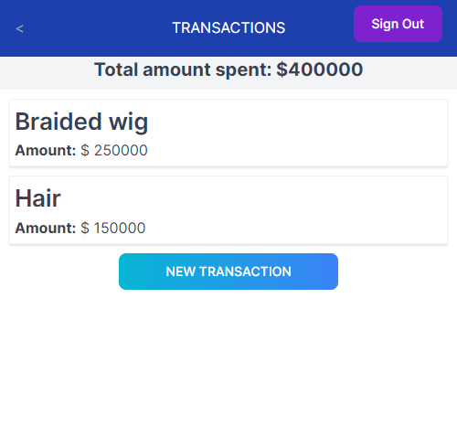
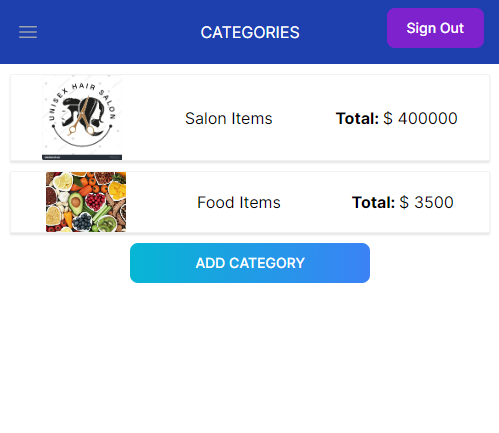

<a name="readme-top"></a>

<div align="center">

<h1><b>BUDGET APP</b></h1>
 
  
  
  
  <br/>

</div>


# 📗 Table of Contents

- [📖 About the Project](#about-project)
  - [🛠 Built With](#built-with)
    - [Tech Stack](#tech-stack)
    - [Key Features](#key-features)
  - [🚀 Live Demo](#live-demo)
- [💻 Getting Started](#getting-started)
  - [Prerequisites](#prerequisites)
  - [Setup](#setup)
  - [Install](#install)
  - [Usage](#usage)
  - [Run tests](#run-tests)
  - [Deployment](#triangular_flag_on_post-deployment)
- [👥 Authors](#authors)
- [🔭 Future Features](#future-features)
- [🤝 Contributing](#contributing)
- [⭐️ Show your support](#support)
- [🙏 Acknowledgements](#acknowledgements)
- [❓ FAQ](#faq)
- [📝 License](#license)

# 📖 [RECIPE APP] <a name="about-project"></a>

**[BUDGET APP]**  Budget App is a mobile web application where you can manage your budget: you have a list of transactions associated with a category, so that you can see how much money you spent and on what. You can also add new transactions and categories.

## 🛠 Built With <a name="built-with"></a>

1- Ruby 3.2.2<br>
2- Rails 7.0.7.2<br>
3- PostgreSQL<br>
4- Gitflow<br>
5- Rubocop<br>
6- RSpec

### Tech Stack <a name="tech-stack"></a>

<details>
  <summary>Client</summary>
  <ul>
    <li><a href="https://www.microverse.org/">Microverse</a></li>
  </ul>
</details>

<details>
<summary>Ruby</summary>
  <ul>
    <li><a href="https://www.ruby-lang.org/">Ruby</a></li>
  </ul>
</details>

<details>
<summary>Rails</summary>
  <ul>
    <li><a href="https://www.rubyonrails.org/">Rails</a></li>
  </ul>
</details>

<details>
<summary>Database</summary>
  <ul>
    <li><a href="https://www.postgresql.org/">PostgreSQL</a></li>
  </ul>
</details>

### Key Features <a name="key-features"></a>
- **[Login page and registration page]**
- **[Category list]**
- **[Display a list of Category added by the logged-in user ]**
- **[Transactions list]**
- **[Display a list of Transactions created by the logged-in user]**


<p align="right">(<a href="#readme-top">back to top</a>)</p>

## 🚀 Live Demo <a name="live-demo"></a>

- [lIVE DEMO](https://duotech.onrender.com)

- [VIDEO DESCRIPTION](https://www.loom.com/share/91adef3e24cb46ba8dedef79b0726cdd?sid=96d068bf-25c9-49b1-963b-704737d305e9)

<p align="right">(<a href="#readme-top">back to top</a>)</p>

## 💻 Getting Started <a name="getting-started"></a>

To get a local copy up and running, follow these steps.

### Prerequisites

In order to run this project you need:

Web Browser (Chrome recommended)<br>
Code editor (VS recommended)<br>
GitHub account<br>

### Setup

Clone this repository to your desired folder:

```sh
  cd my-folder
  git clone "https://github.com/danielochuba/budget-app.git"
```
### Install

Go to your /budget-app folder:

```sh
  cd budget-app
  bundle install
  rails server
```

### Usage

```sh
  rails server
```

### Run Tests

```sh
  rspec spec
```

### Deployment

I deployed this project using:<br>[Render](https://www.render.com)

<p align="right">(<a href="#readme-top">back to top</a>)</p>

## 👥 Authors <a name="authors"></a>

> 👤 **Micronaut Daniel Ochuba Ugochukwu**

- GitHub: [@danielochuba](https://github.com/danielochuba)
- Twitter: [@ochuba_daniel](https://twitter.com/ochuba_daniel)
- LinkedIn: [Daniel Ochuba](https://www.linkedin.com/in/daniel-ochuba-ugochukwu)


<p align="right">(<a href="#readme-top">back to top</a>)</p>

## 🔭 Future Features <a name="future-features"></a>

- [ ] **[Login page and registration page]**
- [ ] **[Category list]**
- [ ] **[Display a list of Category added by the logged-in user ]**
- [ ] **[Transactions list]**
- [ ] **[Display a list of Transactions created by the logged-in user]**


<p align="right">(<a href="#readme-top">back to top</a>)</p>

## 🤝 Contributing <a name="contributing"></a>

Contributions, issues, and feature requests are welcome!

Feel free to check the [issues page](../../issues/).

<p align="right">(<a href="#readme-top">back to top</a>)</p>

## ⭐️ Show your support <a name="support"></a>

If you like this project, please give me a like, it doesn't cost you anything and it helps me a lot to keep working.

<p align="right">(<a href="#readme-top">back to top</a>)</p>

## 🙏 Acknowledgments <a name="acknowledgements"></a>

We would like to thank Bee in Student Success who is always avalaible to solve issues and Microverse for push us to work hard every day!

<p align="right">(<a href="#readme-top">back to top</a>)</p>

## ❓ FAQ <a name="faq"></a>

- **["How can I see more projects associated with these authors?"]**

   - Check my [@danielochuba](https://github.com/danielochuba)

- **[How can I contact the authors of this project?]**
  - Email me at danielochuba78@gmail.com

  
<p align="right">(<a href="#readme-top">back to top</a>)</p>

## 📝 License <a name="license"></a>

This project is [MIT](./LICENSE) licensed.

<p align="right">(<a href="#readme-top">back to top</a>)</p>
 